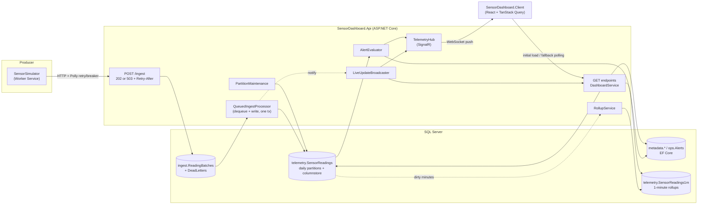

# IoT Digital Twin: Warehouse Cold-Chain Monitor

[](https://github.com/longle7/WarehouseTracker/actions/workflows/ci.yml)

A .NET 10 reimplementation of an AWS CDK "digital twin" architecture (API Gateway + Lambda + DynamoDB + Timestream). A simulator streams fridge telemetry from three warehouses. An ASP.NET Core API queues it durably, stores it (relational metadata split from time-series readings, with 1-minute rollups), raises debounced alerts, and pushes live status to a React dashboard with a clickable 3D twin of each warehouse.



## AWS → .NET mapping

| AWS (original) | .NET (this repo) | Where |
|---|---|---|
| IoT device / telemetry source | **Worker Service** (`BackgroundService` + `PeriodicTimer`) | `src/SensorSimulator` |
| API Gateway (REST) | **ASP.NET Core** controllers | `Controllers/` |
| SQS queue + dead-letter queue | **SQL Server queue tables** read with `READPAST` | `Data/Ingestion/SqlReadingQueue.cs`, `Migrations/*_IngestQueue.cs` |
| SQS-triggered Lambda (ingest) | **`QueuedIngestProcessor`** (`BackgroundService`) → `IReadingWriter` | `Data/Ingestion/`, `SqlReadingWriter` |
| Lambda: scheduled / stream jobs | **`BackgroundService`** hosted in the API (Azure Functions is the serverless alternative) | `PartitionMaintenanceService`, `LiveUpdateBroadcaster`, `RollupService` |
| CloudWatch alarms + SNS | **`AlertEvaluator`** (debounced alert lifecycle) + pluggable `IAlertNotificationSink` | `Data/Alerts/` |
| DynamoDB (metadata) | **SQL Server + EF Core** | `Data/DigitalTwinDbContext.cs` |
| Timestream (readings) | **SQL Server daily-partitioned table + clustered columnstore** (TimescaleDB is the drop-in alternative) | `Migrations/*_TelemetryStore.cs` |
| Timestream retention policy | Partition **TRUNCATE + MERGE** stored procedure | `telemetry.usp_MaintainReadingPartitions` |
| Timestream `bin()` / time buckets | `DATE_BUCKET` (SQL Server 2022+) | `SqlReadingQueries` |
| Timestream scheduled queries / Timescale continuous aggregates | **1-minute rollup table** refreshed from a dirty-minute list | `RollupService`, `telemetry.usp_RefreshRollups` |
| API Gateway WebSocket routes | **SignalR** hub with groups | `Realtime/TelemetryHub.cs` |
| IoT TwinMaker (entities, components, scenes) | Scene metadata in SQL Server + **react-three-fiber** 3D view | `GET /warehouses/{id}/scene`, `components/twin/` |
| Client retry / SDK backoff | **Polly** via `Microsoft.Extensions.Http.Resilience` | `SensorSimulator/Program.cs` |

## Tradeoffs, and why

**Timestream → partitioned SQL Server (not TimescaleDB, for now).**
Readings go in a table split into one partition per UTC day, stored as a clustered columnstore.
- *Why:* one database engine to run, and the time-series techniques are still visible:
  - Time-range queries skip every partition outside the range.
  - Columnstore compresses readings and speeds up aggregation.
  - Retention runs as metadata-only `TRUNCATE`/`MERGE` on whole partitions, never row-by-row `DELETE`.
- *Cost:* things TimescaleDB does for you have to be built by hand. Partitions are created and aged out by a stored procedure that a `BackgroundService` runs, and continuous aggregates are replaced by the rollup job below.
- *Switch trigger:* sustained high ingest, or rollups at several granularities. The store is only reached through `IReadingWriter` and `IReadingQueries`, which pass sensor IDs in and never join to metadata. A TimescaleDB (Npgsql) implementation would replace those two classes and leave everything else alone.

**DynamoDB → SQL Server + EF Core for metadata.**
Warehouses and sensors are small, relational and slow-changing.
- Foreign keys and check constraints (safe temperature range, coordinates) enforce data rules that DynamoDB would leave to application code.
- EF migrations version the schema alongside the code.
- Single-table design and GSIs solve access-pattern problems this data doesn't have.

**Lambda → ASP.NET Core endpoint + `BackgroundService`.**
- An always-on API gives predictable latency with no cold starts.
- It shares one connection pool and one in-process SignalR hub.
- Scheduled work (partition maintenance) and change streaming (the live broadcaster) are hosted services, the equivalent of EventBridge-scheduled or stream-triggered Lambdas.
- *Serverless alternative:* Azure Functions, with an HTTP trigger for ingest, a timer trigger for maintenance, and the Azure SignalR Service output binding. You get scale-to-zero and per-invocation billing, but pay in cold starts and in needing a managed SignalR service.

**API Gateway WebSockets → SignalR.**
- SignalR handles transport negotiation (WebSockets, then SSE, then long polling), reconnection and group routing. With raw API Gateway WebSockets you'd build that yourself on top of connection-ID tables.
- *Cost:* API Gateway manages connections for you, while SignalR connections live on the API instance. Running more than one instance needs Azure SignalR Service or a Redis backplane, which is a one-line change: `AddAzureSignalR()` / `AddStackExchangeRedis()`.

**IoT TwinMaker → scene metadata + react-three-fiber.**
The warehouse page opens on a 3D twin of the floor. Walk-in coolers, reach-in fridges and display cases are generated in code from their dimensions. Click a unit, or its label, to see its live stats and a 15-minute sparkline, with a link to its full history.
- *Scene model:* this mirrors TwinMaker's model. Each sensor is an entity with a unit type (its model) and a position and rotation on the warehouse floor, and `GET /warehouses/{id}/scene` returns the static layout.
- *Live state:* comes from the same SignalR-fed sensor data as the rest of the dashboard. The status beacon, an alert pulse, the door swinging open and faded offline units all update without extra requests.
- *Why not TwinMaker itself:* its live data comes through a Lambda data connector running in AWS, which can't reach a local SQL Server. Its viewer also needs Cognito credentials and AWS resources. Its availability to new accounts is unclear (AWS moved related SiteWise features to maintenance in late 2025).
- *Cost:* no scene composer UI; layouts are edited as data. Models are procedural rather than glTF assets. The scene layout could still be exported to a TwinMaker workspace later, since the entity/component shape matches.

**Push design: server-computed snapshots, not raw readings.**
- After each ingest (bursts are merged into one broadcast), the broadcaster pushes full warehouse and sensor snapshots built by the same `DashboardService` the GET endpoints use. The status rules exist in exactly one place.
- A 5s heartbeat keeps pushing when ingestion stops, so sensors flip to *offline* without any new data. Push-on-ingest alone can't show silence.
- The client writes pushes straight into the TanStack Query cache. If the socket drops, the same queries fall back to polling. After a reconnect they refetch to catch up on anything missed.
- The broadcaster skips all work when no dashboard is connected.

**SQS → a queue table in SQL Server (no separate broker).**
`POST /ingest` validates the batch, stores it in `ingest.ReadingBatches` and returns **202**. `QueuedIngestProcessor` does the write.
- *Exactly-once processing:* the consumer dequeues (`DELETE … OUTPUT` with `READPAST, UPDLOCK`) and inserts the readings **in one transaction**. A batch leaves the queue if and only if its readings are stored. Several consumers can run at once without blocking each other or taking the same batch.
- *Retries and dead letters:* a failed batch rolls back, then is rescheduled with exponential backoff and jitter (`AvailableAt`). After `MaxAttempts` it moves to `ingest.DeadLetters`, or immediately if its payload is unreadable. `POST /ingest/dead-letters/{id}/replay` puts it back.
- *Backpressure:* at `MaxQueueDepth` the endpoint returns **503 with `Retry-After`**, which the simulator's Polly pipeline already honors.
- *Observability:* `GET /ingest/stats` shows queue depth, backlog age, dead letters and processing counters. Each batch's outcome is recorded in the same transaction as its readings, so `GET /ingest/batches/{id}` (the 202's `Location`) reports exactly what happened to it.
- *Why not RabbitMQ or Service Bus:* no extra infrastructure, and the queue shares a transaction with the data it guards, which a separate broker can't. That's the transactional-outbox idea.
- *Cost:* polling instead of push delivery (mitigated by an in-process wake-up on enqueue, with a 1s poll for other instances), and throughput is bounded by the database. `Ingestion:Mode = Direct` switches back to synchronous writes.

**Alerts: a lifecycle, not just a status.**
A sensor's *status* is instantaneous. An *alert* is stored history: `ops.Alerts` rows that open, can be acknowledged, escalate and resolve.
- *Debounced:* an alert opens only after a condition lasts past its grace period (temperature out of range, door open: 30s each; offline: 20s). An offline alert opens only for a sensor that has reported since the evaluator started watching. Otherwise, starting the API before the producers would flood the list with offline alerts. Alerts already open survive restarts. The evaluator finds when the current streak began with one set-based query over the readings, so it keeps no in-memory state and survives restarts.
- *Lifecycle:* critical once any reading is 5°F outside the range, and severity only ratchets up. An unacknowledged critical alert escalates after 5 minutes. Temperature and door alerts resolve only on a good reading, so a sensor that goes offline mid-excursion keeps its alert.
- *Safe with several instances:* a filtered unique index (`SensorId, Kind WHERE ClosedAt IS NULL`) allows only one active alert per sensor and condition.
- *Notifications:* go through `IAlertNotificationSink` (logging today; email, Teams or SNS plug in there) and are pushed to dashboards as `AlertsChanged`.
- *Testing:* the rules are a pure function (`AlertRules`), unit-tested apart from the database.

**Rollups: 1-minute aggregates, refreshed incrementally.**
`telemetry.SensorReadings1m` stores per-minute sums, counts, minimums and maximums, so minutes re-aggregate exactly into any larger bucket.
- *Staying current:* the writer marks each minute it touches in `telemetry.RollupDirty`, in the same SQL batch as the insert. `RollupService` recomputes dirty minutes from raw data with a `MERGE` every 10s. Late or replayed readings simply dirty their minute again.
- *Where it's used:* history requests whose bucket is a whole number of minutes (the 6h and 24h charts) read the rollups. Smaller buckets read raw rows. The `X-History-Source` header says which.
- *Live charts without refetching:* history responses carry each bucket's reading `count`, plus `X-Bucket-Seconds` and `X-Last-Reading-At` headers. The dashboard folds pushed readings newer than that timestamp into its cached buckets, using the counts so averages stay exact, instead of refetching the whole history on every reading. A 30s refetch reconciles rounding and keeps rollup-backed windows fresh.
- *Retention:* rollups are kept for 400 days, well past the 30-day raw retention.
- *Cost:* rollup-backed charts lag by up to one refresh interval.

**Ingestion is idempotent, so retries are safe.**
- The simulator retries POSTs through Polly: exponential backoff with jitter, a circuit breaker and timeouts.
- A retry, or a queue batch reprocessed after an ambiguous commit, can deliver readings the server already stored, so the readings table has a unique index on `(SensorId, Timestamp)` with `IGNORE_DUP_KEY = ON`. Duplicates are counted and dropped instead of failing the batch. Delivery is at-least-once, but each reading is stored once.
- Unknown or inactive sensors, and readings whose warehouse doesn't match the sensor's, are rejected in the same SQL statement.

**Reads and writes use separate code paths.**
- *Writes:* one table-valued-parameter insert per batch (raw ADO.NET, no EF change tracking).
- *Reads:* EF Core for metadata and Dapper for time series, merged in memory. This mirrors a Lambda combining DynamoDB and Timestream results, and keeps each store independently replaceable.

## Repository layout

```
IoTDigitalTwin.slnx
src/
  IoTDigitalTwin.Contracts/   DTOs shared by simulator and API (SensorReadingDto, WarehouseDto, ...)
  SensorSimulator/            Worker Service: loads topology from the API, reading generator + anomalies, HTTP publisher
  SensorDashboard.Api/
    Controllers/              /ingest, /alerts, /warehouses, /sensors
    Data/                     EF Core metadata + migrations
      Ingestion/              queue, consumer, dead letters
      Alerts/                 rules, evaluator, notification sink
      Telemetry/              writer, queries, rollups, partition maintenance
    Services/                 DashboardService (read model + sensor status rules)
    Realtime/                 SignalR hub + live update broadcaster
tests/
  SensorSimulator.Tests/      generator, options validation, topology
  SensorDashboard.Api.Tests/  unit: status/alert rules, range resolution, seed consistency
                              integration: real SQL Server (throwaway DB), HTTP pipeline, SignalR
clients/
  SensorDashboard.Client/     React + TypeScript (Vite): Leaflet map, 3D twin (react-three-fiber), Recharts, TanStack Query, SignalR
```

## Quick start with Docker

```bash
docker compose up --build
```

| | |
|---|---|
| Dashboard | http://localhost:8080 |
| API | http://localhost:5278 (`/health`, `/ingest/stats`, `/alerts`, ...) |
| SQL Server | `localhost,14333`, user `sa`, password `SA_PASSWORD` (dev default in `docker-compose.yml`) |

What happens:
1. `sqlserver` (SQL Server 2022 Developer) starts and waits until it reports healthy.
2. `migrate` runs the EF Core migration bundle (schema, partitioning, queue, rollups, seed data) and exits.
3. `api` starts only after migration succeeds. `simulator` loads its warehouses and sensors from the API, retrying until it's up, then starts streaming.
4. `dashboard` (nginx) serves the built React app and proxies `/api`, including the SignalR WebSocket, to the API on the same origin.

Data persists in the `sqldata` volume; `docker compose down -v` resets it. SQL Server is published on 14333 so it doesn't collide with a local instance on 1433.

## Continuous integration

`.github/workflows/ci.yml` runs on every push and pull request to `main`:
- **.NET:** build, then all tests against a SQL Server 2022 service container. The integration tests create and drop their own database there via `IOT_TEST_SQL`. Test results are uploaded as an artifact.
- **Dashboard:** `npm ci`, lint, unit tests (Vitest) and production build.
- **Compose smoke test:** builds all images and starts the stack, then checks that `/health` passes, that simulator readings reach storage through the queue, and that the dashboard serves the app and proxies the API.

## Running locally without Docker

Prerequisites:
- .NET 10 SDK
- SQL Server 2022 or newer, for `DATE_BUCKET`. Developer Edition is fine. The dev connection string uses Windows auth against `localhost`; see `src/SensorDashboard.Api/appsettings.Development.json`.
- Node 20+

```bash
# 1. Create the database (metadata, seed data, partitioned readings table)
dotnet tool install -g dotnet-ef   # once
dotnet ef database update --project src/SensorDashboard.Api

# 2. API on http://localhost:5278
dotnet run --project src/SensorDashboard.Api --launch-profile http

# 3. Simulator (another terminal). Add `-- --Simulator:AnomalyProbability=0.1` for more action.
dotnet run --project src/SensorSimulator

# 4. Dashboard on http://localhost:5173 (Vite proxies /api and the SignalR hub to the API)
cd clients/SensorDashboard.Client
npm install
npm run dev

# Tests. Integration tests create and drop a throwaway database on localhost; set
# IOT_TEST_SQL to use another SQL Server, e.g. the compose one:
#   IOT_TEST_SQL="Server=localhost,14333;User Id=sa;Password=DevOnly_Passw0rd!;TrustServerCertificate=True" dotnet test
dotnet test
```

## API

| Endpoint | Purpose |
|---|---|
| `POST /ingest` | Batch of `SensorReadingDto` (1–1000). Queued mode: **202** `{ batchId, received }`, or **503** + `Retry-After` when the backlog is full. Direct mode: 200 `{ received, inserted, duplicates, rejected }`. |
| `GET /ingest/batches/{id}` | One batch's fate (the 202's `Location`): `queued`, `retrying` (with next attempt and last error), `processed` (with inserted/duplicate/rejected counts), or `deadLettered`. |
| `GET /ingest/stats` | Queue depth, oldest backlog age, dead-letter count, processing counters. |
| `GET /ingest/dead-letters` · `POST /ingest/dead-letters/{id}/replay` | Inspect failed batches; put one back on the queue. |
| `GET /alerts?state=active\|resolved\|all&warehouseId` | Alerts, most severe and newest first. |
| `POST /alerts/{id}/acknowledge` | `{ by }`. Idempotent; 409 if already resolved. |
| `GET /warehouses` | Warehouses with coordinates and sensor, alert and offline counts. |
| `GET /warehouses/{id}/scene` | Static 3D layout: floor size and each unit's type, position, rotation and dimensions (meters). |
| `GET /warehouses/{id}/sensors` | Sensors with status (`ok`, `alert`, `offline`, `inactive`) and last reading. |
| `GET /sensors/{id}/properties?from&to&bucketSeconds` | Bucketed history as property series: `temperature`, `humidity`, `doorOpen`, `anomalies`. Defaults to the last hour at about 300 points. Whole-minute buckets come from rollups (`X-History-Source: rollup`). |
| `WS /hubs/telemetry` | SignalR. Server events: `WarehousesUpdated`, `SensorsUpdated(warehouseId, sensors)`, `ReadingsIngested(sensorId, readings)`, `AlertsChanged(alerts)`. Client methods: `SubscribeWarehouse`/`UnsubscribeWarehouse`, `SubscribeSensor`/`UnsubscribeSensor`. |

Sensor status is evaluated in this order:
1. `inactive`: disabled in metadata.
2. `offline`: no reading for 20s (4 missed ticks at the simulator's default 5s interval).
3. `alert`: the latest reading is flagged, or outside the sensor's own safe range.
4. `ok`: otherwise.

The thresholds live in the `Dashboard` configuration section. Alert grace periods, escalation and severity live in `Alerts`, queue limits in `Ingestion`, and rollup settings in `Telemetry`.

## Not yet built (production gaps)

- **Authentication:** device credentials for `/ingest`, user auth (and roles for acknowledging alerts) for the dashboard and hub.
- **Real notification channels:** email, Teams or SMS behind `IAlertNotificationSink`.
- **Cloud deployment and SignalR scale-out** (e.g. Azure Container Apps + Azure SQL + Azure SignalR Service).
- **End-to-end browser tests** (Playwright) for the dashboard.
