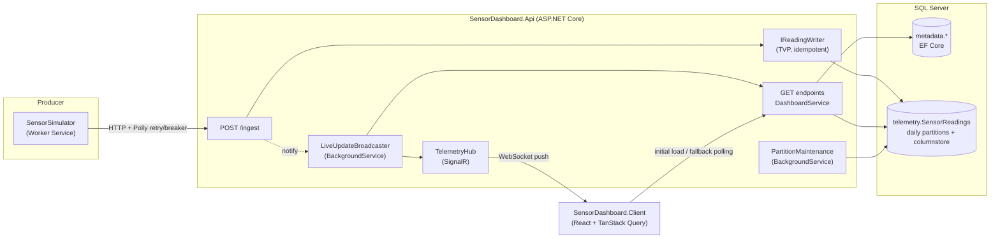

# IoT Digital Twin: Warehouse Cold-Chain Monitor

A .NET 10 reimplementation of an AWS CDK "digital twin" architecture (API Gateway + Lambda + DynamoDB + Timestream). A simulator streams fridge telemetry from three warehouses. An ASP.NET Core API stores it, splitting relational metadata from time-series readings, and pushes live status to a React dashboard over SignalR.



## AWS → .NET mapping

| AWS (original) | .NET (this repo) | Where |
|---|---|---|
| IoT device / telemetry source | **Worker Service** (`BackgroundService` + `PeriodicTimer`) | `src/SensorSimulator` |
| API Gateway (REST) | **ASP.NET Core** controllers | `Controllers/` |
| Lambda: ingest handler | **ASP.NET Core endpoint** → `IReadingWriter` | `IngestController`, `SqlReadingWriter` |
| Lambda: scheduled / stream jobs | **`BackgroundService`** hosted in the API (Azure Functions is the serverless alternative) | `PartitionMaintenanceService`, `LiveUpdateBroadcaster` |
| DynamoDB (metadata) | **SQL Server + EF Core** | `Data/DigitalTwinDbContext.cs` |
| Timestream (readings) | **SQL Server daily-partitioned table + clustered columnstore** (TimescaleDB is the drop-in alternative) | `Migrations/*_TelemetryStore.cs` |
| Timestream retention policy | Partition **TRUNCATE + MERGE** stored procedure | `telemetry.usp_MaintainReadingPartitions` |
| Timestream `bin()` / time buckets | `DATE_BUCKET` (SQL Server 2022+) | `SqlReadingQueries` |
| API Gateway WebSocket routes | **SignalR** hub with groups | `Realtime/TelemetryHub.cs` |
| IoT TwinMaker (entities, components, scenes) | Scene metadata in SQL Server + **react-three-fiber** 3D view | `GET /warehouses/{id}/scene`, `components/twin/` |
| Client retry / SDK backoff | **Polly** via `Microsoft.Extensions.Http.Resilience` | `SensorSimulator/Program.cs` |

## Tradeoffs, and why

**Timestream → partitioned SQL Server (not TimescaleDB, for now).**
Readings go in a table split into one partition per UTC day, stored as a clustered columnstore.
- *Why:* one database engine to run, and the time-series techniques are still visible:
  - Time-range queries skip every partition outside the range.
  - Columnstore compresses readings and speeds up aggregation.
  - Retention runs as metadata-only `TRUNCATE`/`MERGE` on whole partitions, never row-by-row `DELETE`.
- *Cost:* things TimescaleDB does for you have to be built by hand. Partitions are created and aged out by a stored procedure that a `BackgroundService` runs. There are no continuous aggregates, so long-window dashboards aggregate at query time.
- *Switch trigger:* sustained high ingest, or needing pre-computed rollups. The store is only reached through `IReadingWriter` and `IReadingQueries`, which pass sensor IDs in and never join to metadata. A TimescaleDB (Npgsql) implementation would replace those two classes and leave everything else alone.

**DynamoDB → SQL Server + EF Core for metadata.**
Warehouses and sensors are small, relational and slow-changing.
- Foreign keys and check constraints (safe temperature range, coordinates) enforce data rules that DynamoDB would leave to application code.
- EF migrations version the schema alongside the code.
- Single-table design and GSIs solve access-pattern problems this data doesn't have.

**Lambda → ASP.NET Core endpoint + `BackgroundService`.**
- An always-on API gives predictable latency with no cold starts.
- It shares one connection pool and one in-process SignalR hub.
- Scheduled work (partition maintenance) and change streaming (the live broadcaster) are hosted services, the equivalent of EventBridge-scheduled or stream-triggered Lambdas.
- *Serverless alternative:* Azure Functions, with an HTTP trigger for ingest, a timer trigger for maintenance, and the Azure SignalR Service output binding. You get scale-to-zero and per-invocation billing, but pay in cold starts and in needing a managed SignalR service.

**API Gateway WebSockets → SignalR.**
- SignalR handles transport negotiation (WebSockets, then SSE, then long polling), reconnection and group routing. With raw API Gateway WebSockets you'd build that yourself on top of connection-ID tables.
- *Cost:* API Gateway manages connections for you, while SignalR connections live on the API instance. Running more than one instance needs Azure SignalR Service or a Redis backplane, which is a one-line change: `AddAzureSignalR()` / `AddStackExchangeRedis()`.

**IoT TwinMaker → scene metadata + react-three-fiber.**
The warehouse page opens on a 3D twin of the floor. Walk-in coolers, reach-in fridges and display cases are generated in code from their dimensions. Click a unit, or its label, to see its live stats and a 15-minute sparkline, with a link to its full history.
- *Scene model:* this mirrors TwinMaker's model. Each sensor is an entity with a unit type (its model) and a position and rotation on the warehouse floor, and `GET /warehouses/{id}/scene` returns the static layout.
- *Live state:* comes from the same SignalR-fed sensor data as the rest of the dashboard. The status beacon, an alert pulse, the door swinging open and faded offline units all update without extra requests.
- *Why not TwinMaker itself:* its live data comes through a Lambda data connector running in AWS, which can't reach a local SQL Server. Its viewer also needs Cognito credentials and AWS resources. Its availability to new accounts is unclear (AWS moved related SiteWise features to maintenance in late 2025).
- *Cost:* no scene composer UI; layouts are edited as data. Models are procedural rather than glTF assets. The scene layout could still be exported to a TwinMaker workspace later, since the entity/component shape matches.

**Push design: server-computed snapshots, not raw readings.**
- After each ingest (bursts are merged into one broadcast), the broadcaster pushes full warehouse and sensor snapshots built by the same `DashboardService` the GET endpoints use. The status rules exist in exactly one place.
- A 5s heartbeat keeps pushing when ingestion stops, so sensors flip to *offline* without any new data. Push-on-ingest alone can't show silence.
- The client writes pushes straight into the TanStack Query cache. If the socket drops, the same queries fall back to polling. After a reconnect they refetch to catch up on anything missed.
- The broadcaster skips all work when no dashboard is connected.

**Ingestion is idempotent, so retries are safe.**
- The simulator retries POSTs through Polly: exponential backoff with jitter, a circuit breaker and timeouts.
- A retry can deliver a batch the server already stored, so the readings table has a unique index on `(SensorId, Timestamp)` with `IGNORE_DUP_KEY = ON`. Duplicates are counted and dropped instead of failing the batch. Delivery is at-least-once, but each reading is stored once.
- Unknown or inactive sensors, and readings whose warehouse doesn't match the sensor's, are rejected in the same SQL statement.

**Reads and writes use separate code paths.**
- *Writes:* one table-valued-parameter insert per batch (raw ADO.NET, no EF change tracking).
- *Reads:* EF Core for metadata and Dapper for time series, merged in memory. This mirrors a Lambda combining DynamoDB and Timestream results, and keeps each store independently replaceable.

## Repository layout

```
IoTDigitalTwin.slnx
src/
  IoTDigitalTwin.Contracts/   DTOs shared by simulator and API (SensorReadingDto, WarehouseDto, ...)
  SensorSimulator/            Worker Service: topology, reading generator + anomalies, HTTP publisher
  SensorDashboard.Api/
    Controllers/              /ingest, /warehouses, /sensors
    Data/                     EF Core metadata, migrations, telemetry writer/queries, partition maintenance
    Services/                 DashboardService (read model + sensor status)
    Realtime/                 SignalR hub + live update broadcaster
clients/
  SensorDashboard.Client/     React + TypeScript (Vite): Leaflet map, 3D twin (react-three-fiber), Recharts, TanStack Query, SignalR
```

## Running locally

Prerequisites:
- .NET 10 SDK
- SQL Server 2022 or newer, for `DATE_BUCKET`. Developer Edition is fine. The dev connection string uses Windows auth against `localhost`; see `src/SensorDashboard.Api/appsettings.Development.json`.
- Node 20+

```bash
# 1. Create the database (metadata, seed data, partitioned readings table)
dotnet tool install -g dotnet-ef   # once
dotnet ef database update --project src/SensorDashboard.Api

# 2. API on http://localhost:5278
dotnet run --project src/SensorDashboard.Api --launch-profile http

# 3. Simulator (another terminal). Add `-- --Simulator:AnomalyProbability=0.1` for more action.
dotnet run --project src/SensorSimulator

# 4. Dashboard on http://localhost:5173 (Vite proxies /api and the SignalR hub to the API)
cd clients/SensorDashboard.Client
npm install
npm run dev
```

## API

| Endpoint | Purpose |
|---|---|
| `POST /ingest` | Batch of `SensorReadingDto` (1–1000). Returns `{ received, inserted, duplicates, rejected }`. |
| `GET /warehouses` | Warehouses with coordinates and sensor, alert and offline counts. |
| `GET /warehouses/{id}/scene` | Static 3D layout: floor size and each unit's type, position, rotation and dimensions (meters). |
| `GET /warehouses/{id}/sensors` | Sensors with status (`ok`, `alert`, `offline`, `inactive`) and last reading. |
| `GET /sensors/{id}/properties?from&to&bucketSeconds` | Bucketed history as property series: `temperature`, `humidity`, `doorOpen`, `anomalies`. Defaults to the last hour at about 300 points. |
| `WS /hubs/telemetry` | SignalR. Server events: `WarehousesUpdated`, `SensorsUpdated(warehouseId, sensors)`, `ReadingsIngested(sensorId, readings)`. Client methods: `SubscribeWarehouse`/`UnsubscribeWarehouse`, `SubscribeSensor`/`UnsubscribeSensor`. |

Sensor status is evaluated in this order:
1. `inactive`: disabled in metadata.
2. `offline`: no reading for 20s (4 missed ticks at the simulator's default 5s interval).
3. `alert`: the latest reading is flagged, or outside the sensor's own safe range.
4. `ok`: otherwise.

The thresholds live in the `Dashboard` configuration section.

## Not yet built (production gaps)

- **Queue-based ingestion** (RabbitMQ or Azure Service Bus) behind `IReadingPublisher`, for backpressure and replay. HTTP was chosen first because it was the fastest to stand up.
- **Authentication:** device credentials for `/ingest`, user auth for the dashboard and hub.
- **Automated tests:** unit tests for the generator and status rules, and integration tests against SQL Server with Testcontainers.
- **SignalR scale-out** (Azure SignalR Service) and containerized deployment.
- **Pre-computed rollups** for long-window charts, and alert notifications (email or Teams) on status transitions.
- **Single topology source:** the simulator still has its own copy of the seed list; it should load warehouses and sensors from the API.
